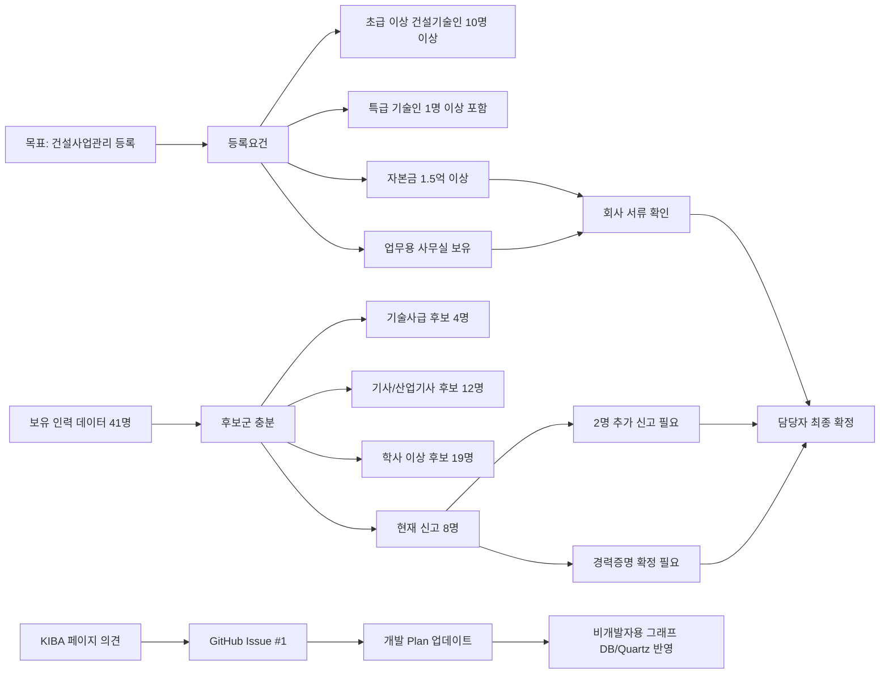

# 엔지니어링협회등록 그래프 DB

이 노트는 개발자가 아니어도 현재 상태를 따라갈 수 있도록, 엔지니어링협회 등록 업무를 "무엇이 무엇과 연결되어 있는가"로 정리한 보기입니다. 공개 노트에는 직원 실명, 개별 자격증 조합, 개인정보를 넣지 않습니다.

## 한 줄 결론

건설사업관리 등록은 조건부 가능 상태입니다. 인력 후보는 충분하지만, 최종 등록을 위해서는 경력증명 확정, 2명 추가 신고, 자본금/사무실 서류 확인이 남아 있습니다.

## 비개발자용 관계도

## 노드 설명

| 노드 | 뜻 | 공개 여부 |
|---|---|---|
| 목표 | 건설사업관리 분야 등록 가능 여부 | 공개 가능 |
| 등록요건 | 법에서 요구하는 인력/자본금/사무실 조건 | 공개 가능 |
| 보유 인력 데이터 | 전체 인력 41명 기준 집계 | 집계만 공개 |
| 후보군 | 자격/학력/경력상 등록 가능성이 있는 사람들 | 인원수만 공개 |
| 경력증명 | 협회가 인정하는 경력증명서와 등록등급 | 개인별 상세는 비공개 |
| 회사 서류 | 자본금, 사무실 보유 증빙 | 공개 이슈에는 확인 상태만 표시 |
| GitHub Issue | 의견과 진행상황이 모이는 공개 추적 공간 | 공개 가능 |
| 개발 Plan | 의견을 실제 작업 항목으로 바꾼 목록 | 개인정보 제외 후 공개 |

## PDF 근거

- 문서: `docs/엔지니어링협회등록 진행상황보고.pdf`
- 기준일: 2026-06-19
- 핵심 판단: "조건부 가능"
- 현재 상태: 건설기술인협회 신고 기준 기존 3명 + 신규 5명 = 8명
- 부족분: 등록요건 10명까지 2명 추가 신고 필요
- 보강 필요: 특급/초급 등급 확정을 위한 경력증명서, 자본금/사무실 회사 서류 확인

## 의견이 들어왔을 때 처리 규칙

KIBA 진행 페이지에서 의견을 남기면 GitHub Issue에 코멘트로 쌓입니다. 코멘트가 비개발자 의견일 가능성이 높으므로, 바로 코드 작업으로 보지 않고 다음 네 가지 중 하나로 분류합니다.

| 분류 | 예시 | 처리 |
|---|---|---|
| 질문 | "왜 2명이 더 필요한가요?" | 비개발자용 설명 보강 |
| 사실 제보 | "A 부서에도 등록 가능한 인력이 있습니다." | 비공개 원자료 확인 항목으로 이동 |
| 요청 | "원장님 보고용으로 한 장 요약이 필요합니다." | 산출물/문서 작업으로 전환 |
| 결정 | "이번 주에는 경력증명서부터 받겠습니다." | 개발/운영 Plan 체크리스트 업데이트 |

## 개발 Plan으로 바뀌는 항목

- [ ] Issue 댓글을 질문/사실 제보/요청/결정으로 분류한다.
- [ ] 개인정보가 있는 댓글은 공개 이슈에 상세 확산하지 않고 비공개 원자료 확인 항목으로 옮긴다.
- [ ] 등록요건 그래프 DB에는 집계, 상태, 필요한 서류만 남긴다.
- [ ] Quartz 페이지에는 비개발자용 결론과 다음 행동을 먼저 보여준다.
- [ ] GitHub Issue #1에는 세부 개발 Plan과 근거 PDF 반영 내역을 남긴다.

## 연결

- [[Knowledge/Issues/Issue 1 - [인력 관리] 엔지니어링 협회 등록을 위한 자격증 및 요건 검토|Issue 1 - 상위 이슈]]
- [[Knowledge/Issues/Issue 11 - [인력 관리] 엔지니어링 협회 등록 자격증·요건 검토 — 실행 계획 (Issue #1 세부)|Issue 11 - 실행 계획]]
- [[Knowledge/Sources/Docs Index|Docs Index]]
