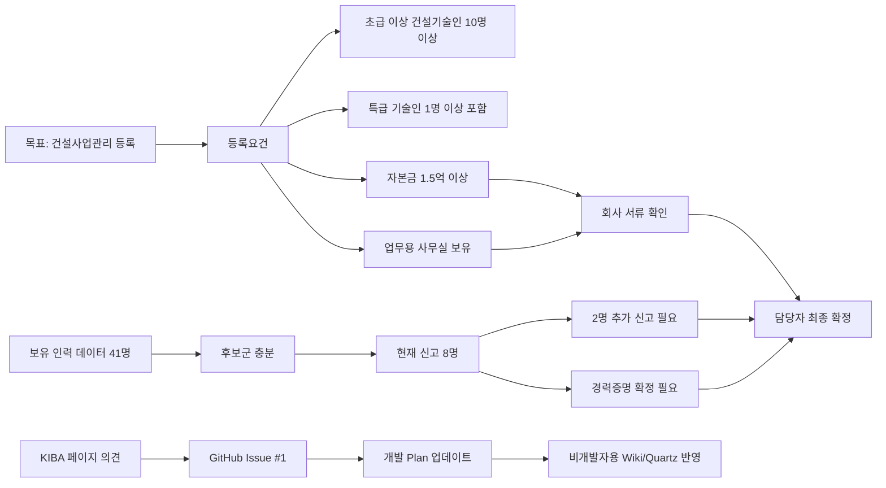

Source: Knowledge/Sources/엔지니어링협회등록 그래프 DB.md

# 엔지니어링협회등록 그래프 DB

이 페이지는 개발자가 아니어도 엔지니어링협회 등록 업무의 현재 상태를 이해할 수 있도록 만든 관계도입니다. 공개 페이지에는 직원 실명, 개별 자격증 조합, 개인정보를 넣지 않습니다.

## 한 줄 결론

건설사업관리 등록은 조건부 가능 상태입니다. 인력 후보는 충분하지만, 최종 등록을 위해서는 경력증명 확정, 2명 추가 신고, 자본금/사무실 서류 확인이 남아 있습니다.

## 관계도

## PDF 근거

- 문서: `docs/엔지니어링협회등록 진행상황보고.pdf`
- 기준일: 2026-06-19
- 핵심 판단: 조건부 가능
- 현재 상태: 건설기술인협회 신고 기준 기존 3명 + 신규 5명 = 8명
- 부족분: 등록요건 10명까지 2명 추가 신고 필요
- 보강 필요: 특급/초급 등급 확정을 위한 경력증명서, 자본금/사무실 회사 서류 확인

## 의견 처리 규칙

KIBA 진행 페이지에서 남긴 의견은 GitHub Issue에 코멘트로 쌓입니다. 코멘트는 질문, 사실 제보, 요청, 결정으로 분류하고, 개인정보가 포함된 내용은 공개 페이지에 확산하지 않습니다.

## 연결

- [Issue 1 - 상위 이슈](Issue-1---[인력-관리]-엔지니어링-협회-등록을-위한-자격증-및-요건-검토)
- [Issue 11 - 실행 계획](Issue-11---[인력-관리]-엔지니어링-협회-등록-자격증·요건-검토-—-실행-계획-(Issue-1-세부))
